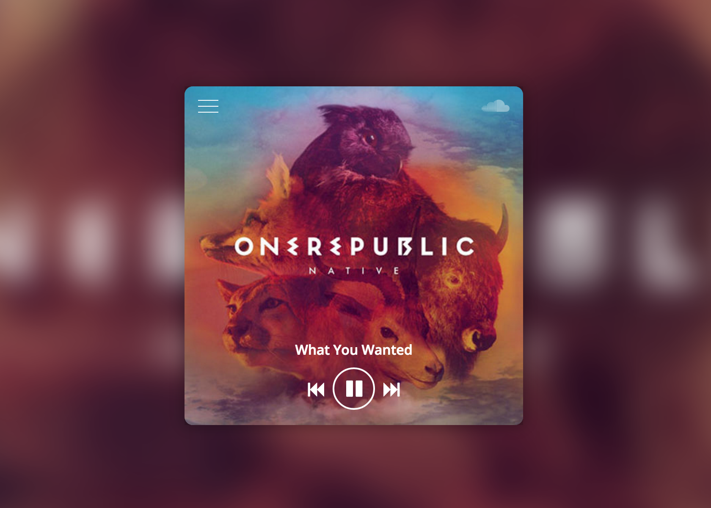

# Mini Player using React + Flux.
Just a simple player to explore Flux and React, using [SoundCloud API](https://developers.soundcloud.com/).

[DEMO](http://player-rafaell18.rhcloud.com/)

 

I've follow this [exemple of template](https://www.behance.net/gallery/Rdio-Music-Player-Concept/8885567) to do this app. Thanks [David Stubbs](https://www.behance.net/davekilljoy).

This app requires node.js!

```javascript
npm install
```

If you want to compile the whole thing, just run:

```javascript
webpack
```

Yeap, you should have webpack installed in your system.

##Dependencies
Basicaly you can se everything in `package.json`

- React.js
- Flux
- Babel
- Sass
- Webpack
